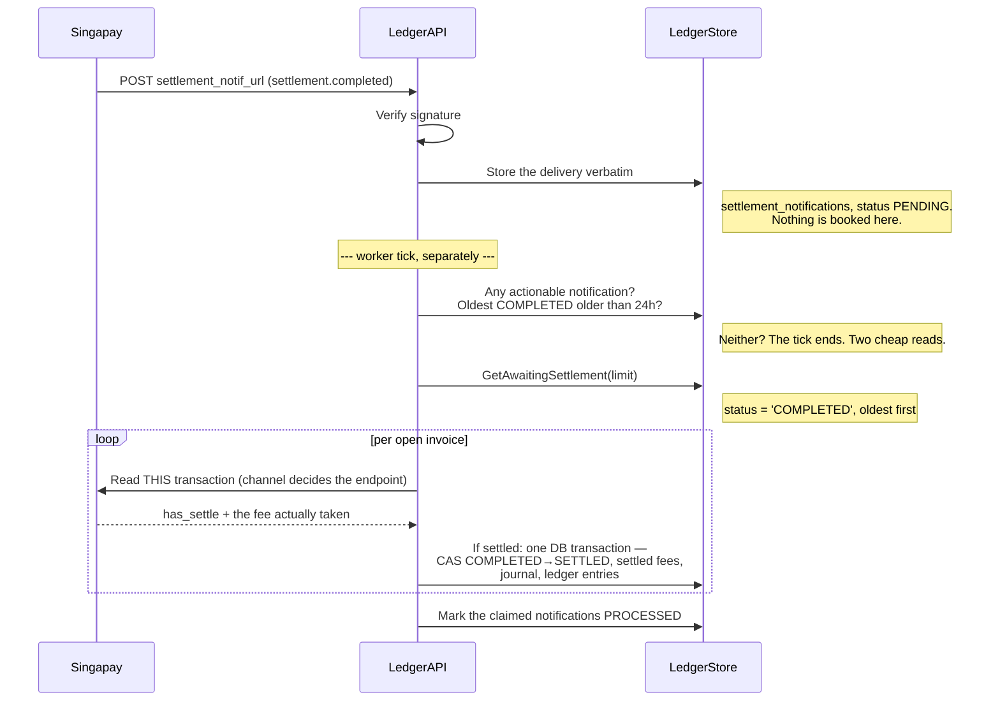

# Settlement — the per-transaction path

> **Implemented.** `ProcessSettlementNotifications` in [`settlement.go`](../settlement.go) is the
> worker's entry point and is safe to call on a schedule forever. An earlier version of this
> document described a window-replay design that was never built and said settlement was not
> implemented; that approach and the reason it was abandoned are kept at the bottom, under
> [The approach that was rejected](#the-approach-that-was-rejected).

Settlement is the step that converts a seller's `PENDING` balance into `AVAILABLE`. Until it
runs, money can arrive and be booked, and payouts can be made against whatever is already
`AVAILABLE` — but nothing new becomes withdrawable, and `ProcessPlatformFeeTransfer` finds no
work because nothing reaches `SETTLED`.

## The idea in one line

Singapay publishes no settlement file, and its settlement webhook carries totals and a date
window but **no list of the transactions a batch covered**. There are two ways to close that
gap: reconstruct the list, or never need it. This is the second.

```
the webhook says "something settled"      -> stored verbatim, nothing booked
the ledger says "these invoices are open" -> GetAwaitingSettlement
Singapay is asked about each one directly -> has_settle, and the fee it actually took
```

No window is ever used to select rows, so no window can be misread.

## Flow



## What the webhook is, and is not

It is a **doorbell**. `HandleSettlementNotification` verifies the signature, parses the
payload, stores it in `settlement_notifications` exactly as it arrived, and books nothing.
The totals, the window and `total_transactions` are recorded for audit and for support
conversations; not one of them decides which transactions settled.

That makes the webhook an optimisation for latency, not a correctness dependency. A delivery
that never arrives delays settlement to the next floor-age tick rather than losing it.

Two kinds of delivery are parked as `NEEDS_REVIEW` rather than acted on:

- **Refund events.** `settlement.refunded` can pull back funds that are already `AVAILABLE`
  and may already have been withdrawn. This ledger has no negative-balance policy, and a
  webhook handler is the wrong place to invent one. Still open — see below.
- **Settlements that pay out.** `settlement_method` of `bank-account` or `e-wallet` sends
  money to a nominated account instead of moving `PENDING` into `AVAILABLE`, so a pass
  triggered by one would look for work that is not there.

A redelivery is ordinary traffic: the `UNIQUE (settlement_id, event)` identity absorbs it and
the caller is told success either way.

## What triggers a pass

`ProcessSettlementNotifications` runs when **either** is true:

1. There is a stored notification not yet acted on, or
2. the oldest unsettled `COMPLETED` transaction has been waiting longer than
   `SettlementFloorAge` (24 hours).

The second condition is the one that matters most. "Only act on a notification" reintroduces
exactly the failure this design removes: if a delivery is lost — an IP allowlist change, a
deploy window, retries exhausted — nothing would ever run again and transactions would sit in
`COMPLETED` indefinitely with no error anywhere. 24 hours clears the T+1 cycle with room to
spare, so on a healthy system the floor never fires.

On a quiet tick the whole call is two cheap reads and a return.

**The number to alarm on is `OldestAwaitingAge`.** It climbs monotonically whenever settlement
stops working — including when the pass itself runs cleanly and books nothing, which is the
failure mode a success/failure counter cannot see.

## Reading one transaction back

The read is a point lookup, not a search: the channel says which endpoint, the payment request
says which key.

| Channel | Endpoint | Key, in order of preference |
|---|---|---|
| Virtual account | `GetVATransaction` | `GatewayTransactionRef`, else lookup by `PaymentCode` (the VA number) |
| QRIS | QRIS detail | `GatewayTransactionID`, else `RequestID` |
| E-wallet | E-wallet detail | `GatewayTransactionID`, else `RequestID` |
| Payment link | `GetPaymentLinkHistory` | `GatewayTransactionID`, else `RequestID` |

`GatewayTransactionID` and `GatewayTransactionRef` come from the money-in webhook
([101](./101-payment-execution.md)) and are the direct keys. `RequestID` and `PaymentCode`, recorded at
instrument creation, are the fallbacks for rows that predate those columns — and the fallback
differs per channel because **the instrument and the transaction are the same entity for QRIS
and e-wallet, and different entities for VA and payment link**. A VA is a container; the
payment that arrives in it has its own business id. A payment link can carry several attempts,
each with its own.

`domain.SettledTransaction` flattens the four channel shapes into one so the settling logic
carries no per-channel branches beyond key selection. It is a value type: no table, no
repository, built from a gateway response and discarded. What survives is the journal metadata
written from it.

## Booking

Everything happens in one database transaction whose **first statement is the conditional
`COMPLETED → SETTLED` move**. That ordering is the point: the conditional update takes the row
lock, and a caller that finds the row already moved rolls back having written nothing. Two
passes racing on one transaction produce one settlement, not two sets of insert-only entries
that would need an audit to unpick.

In order:

1. `UpdateStatusIf(COMPLETED → SETTLED)` — the brake.
2. `SaveSettledFees` — what the fees turned out to be. Written inside the same transaction so
   the platform fee transfer can never find a `SETTLED` row whose figures are still unset.
3. The settlement journal, whose metadata is the permanent audit trail:
   `actual_gateway_fee`, `expected_gateway_fee`, `fee_delta`, `fee_reported`,
   `settled_platform_fee`, `settled_seller_net`, `raw_gateway_data`.
4. The ledger entries: `PENDING` → `AVAILABLE` for seller and platform, the gateway expense
   account cleared, and a `FEE_ADJUSTMENT` where the fee Singapay took differs from the one
   priced. The rules are [104](./104-fee-mismatch-reconciliation.md).

Where the delta cannot be absorbed — the platform would owe more than it ever charged, or the
seller would receive less than nothing — the transaction is **left in `COMPLETED`** for a
person. It keeps appearing in `GetAwaitingSettlement` and keeps pushing up the oldest-awaiting
age, which is the loud failure rather than the silent one.

## Cost

One call per open invoice, instead of N accounts × up to 4 product lists × pagination per
settlement. The work set is "what is still `COMPLETED`", which shrinks as the pass succeeds
rather than growing with the size of the merchant. A pass is resumable by construction: what a
truncated pass did not reach is simply still there on the next tick, oldest first.
`defaultSettlementBatchSize` (200) bounds one pass.

## What is still open

**The refund policy.** `settlement.refunded` is stored as `NEEDS_REVIEW` and never acted on
automatically. Deciding what it should do means deciding whether a seller's balance may go
negative, and what happens when the money has already been withdrawn. That is a business
decision, not a coding gap, and it is the only part of settlement that is deliberately absent.

---

## The approach that was rejected

The first design reconstructed a batch's rows by replaying its date window against the
per-product transaction lists (`ListVATransactions` and its three siblings, filtered on
`SettlementWindow`). Those methods still exist on the `PaymentGateway` interface for operators
and smoke tests; nothing in the settlement path calls them.

It was abandoned because two of its assumptions could not be verified from Singapay's
documentation, and **each has a wrong answer that produces a plausible-looking result**:

1. **The timezone and boundary of the settlement window.** Singapay writes settlement
   timestamps as text with no offset — `"26 Dec 2025 13:35:45"`. Asia/Jakarta is an
   assumption, documented as such in `singapay.TextTime`, not a fact Singapay states. Seven
   hours in either direction moves rows between batches: some settle twice, others never.
   Whether the bounds are inclusive is equally unstated.

2. **Which settlement event the window keys on.** A QRIS transaction carries
   `HasSettle`/`SettleAt` *and* `HasSettleToMerchant`/`SettledToMerchantAt`. Those are
   different moments, and filtering on the wrong one returns a set of rows that looks entirely
   reasonable and is wrong.

A third concern was viability rather than correctness — N accounts × 4 product lists ×
pagination per settlement, against unmeasured rate limits.

**The per-transaction path does not ask any of the three.** It never uses a window to select
rows, so questions 1 and 2 became moot rather than answered; and its cost is bounded by work
that is shrinking rather than by the size of the merchant. Question 4 of the original list, the
refund policy, was the one question that did not depend on the mechanism — which is why it is
still open above.

`settlement_batches`, `settlement_items` and `reconciliation_discrepancies` were the storage
for that design. They were never written by the path that shipped and were removed by
[migration 026](../database/migrations/026_settlement_cleanup_contract.sql); `settlement_notifications`
took over the "have I seen this settlement?" role, and the journal metadata took over the fee
audit trail.
