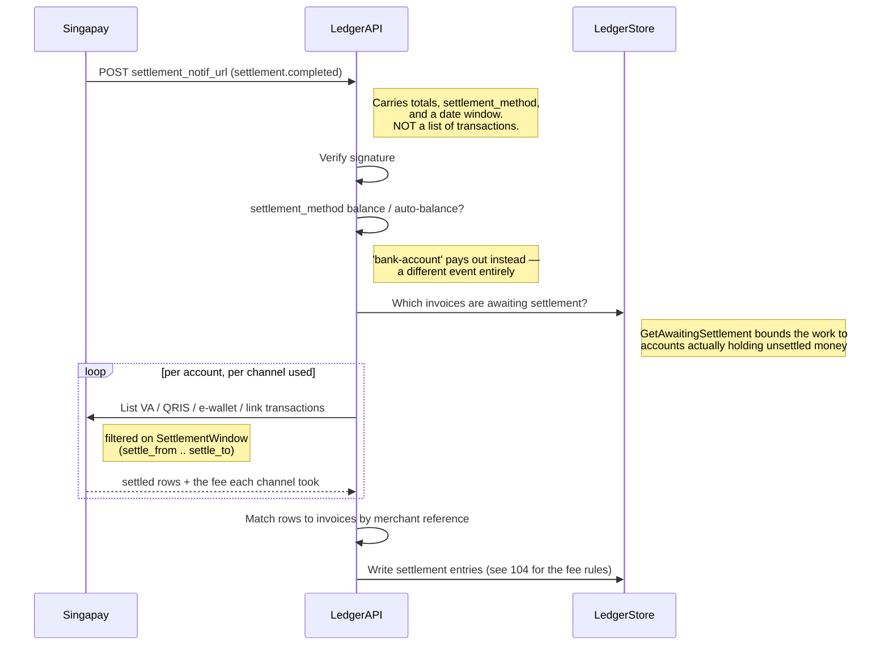

# Settlement & Reconciliation

> **Not implemented.** `ProcessReconciliation` returns `ErrReconciliationNotImplemented` and
> books nothing. This document describes the design and, more importantly, the four questions
> that have to be answered before it can be built. See [`reconciliation.go`](../reconciliation.go).

Reconciliation is the step that converts a seller's `PENDING` balance into `AVAILABLE`.
Until it lands, money can arrive and be booked, and payouts can be made against whatever is
already `AVAILABLE` — but nothing new becomes withdrawable, and
`ProcessPlatformFeeTransfer` finds no work because nothing reaches `SETTLED`.

## Why it is absent rather than approximated

Ledger entries are insert-only. A settlement booked on a wrong assumption cannot be undone,
only compensated with a second set of entries and an audit. So an approximation here is more
expensive than an absence: the absence is loud, while a wrong `PENDING` → `AVAILABLE`
conversion is silent — and it decides what a seller is allowed to withdraw.

## What replaced the settlement file

There isn't one. The previous gateway published a settlement CSV: a single artefact naming
every transaction in the batch, its amount and its fee. Singapay publishes a webhook.

`domain.SettledTransaction` exists to flatten the four channel shapes into one, because the
reconciler should not carry four branches for what is nearly the same row.

## The four open questions

Each has a wrong answer that produces a plausible-looking result. That is why none of them
can be guessed.

### 1. Timezone and boundary of the settlement window

Singapay writes settlement timestamps as human-readable text with no offset —
`"26 Dec 2025 13:35:45"`. Asia/Jakarta is an assumption, documented as such in
`singapay.TextTime`, not a fact Singapay states. Seven hours in either direction moves rows
between batches: some settle twice, others never.

Whether the window bounds are inclusive is equally unstated.

### 2. Which settlement event the window keys on

A QRIS transaction carries `HasSettle`/`SettleAt` **and** `HasSettleToMerchant`/
`SettledToMerchantAt`. Those are different moments. Filtering on the wrong one returns a set
of rows that looks entirely reasonable and is wrong.

### 3. Whether the reconstruction scales

N accounts × up to 4 product lists × pagination, per settlement. Rate limits and page
behaviour are unmeasured. `GetAwaitingSettlement` bounds N to accounts actually holding
unsettled money rather than every sub-account the merchant owns, which helps — but the
ordering is still different from reading one file.

This is a viability question, not a correctness one. It may be the one that changes the
design.

### 4. What `settlement.refunded` should do

It can pull back funds that have already become `AVAILABLE` and may already have been
withdrawn. This ledger has no negative-balance policy, and inventing one inside a
reconciliation routine is the wrong place to decide it. **This is a business decision, not a
coding gap.**

## How to answer them

`cmd/singapay-smoke` is where (1) and (2) get settled: create a VA payment in sandbox, let it
settle, then compare the settlement webhook's window against the timestamps on the
transaction record. (3) needs a sandbox with enough volume to page. (4) needs a person.

## What is already in place

- `domain.SettlementBatch` — carries `BatchID` (the idempotency key), `SettlementReference`,
  and `SettleFrom`/`SettleTo`. The constructor **requires** the window, because a batch
  without one can never be reprocessed or audited.
- `domain.SettlementItem` — one settled gateway row, with `FeeReported` recording whether its
  fee is a fact or a fallback. See [104](./104-fee-mismatch-reconciliation.md).
- `domain.SettledTransaction` — the normalised shape across the four channels.
- The ledger-entry side is unchanged and correct: `PENDING` → `AVAILABLE` conversion, fee
  adjustment write-offs and credits, gateway fee clearance. Singapay's pending/available split
  matches this ledger's, which is why the model survived the migration intact.
- Schema: `settlement_batches` and `settlement_items` are migrated
  ([018](../database/migrations/018_migrate_to_singapay.sql)).

What is missing is only the part that decides which rows belong to a batch — and that is
exactly the part that is unverified.
