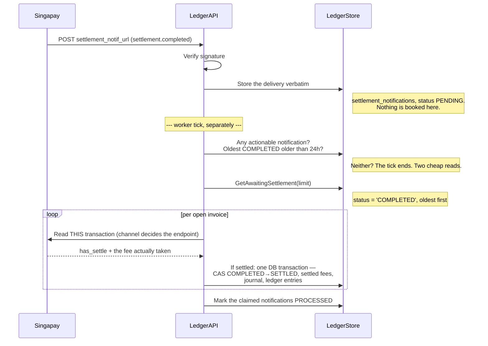

# Settlement — the per-transaction path

> **Implemented.** `ProcessSettlementNotifications` in [`settlement.go`](../settlement.go) is the
> worker's entry point and is safe to call on a schedule forever. An earlier version of this
> document described a window-replay design that was never built and said settlement was not
> implemented; that approach and the reason it was abandoned are kept at the bottom, under
> [The approach that was rejected](#the-approach-that-was-rejected).

Settlement is the step that converts a seller's `PENDING` balance into `AVAILABLE`. Until it
runs, money can arrive and be booked, and payouts can be made against whatever is already
`AVAILABLE` — but nothing new becomes withdrawable, and `ProcessPlatformFeeTransfer` finds no
work because nothing reaches `SETTLED`.

## The idea in one line

Singapay publishes no settlement file, and its settlement webhook carries totals and a date
window but **no list of the transactions a batch covered**. There are two ways to close that
gap: reconstruct the list, or never need it. This is the second.

```
the webhook says "something settled"      -> stored verbatim, nothing booked
the ledger says "these invoices are open" -> GetAwaitingSettlement
Singapay is asked about each one directly -> has_settle, and the fee it actually took
```

No window is ever used to select rows, so no window can be misread.

## Flow


```mermaid
sequenceDiagram
    participant Singapay
    participant LedgerAPI
    participant LedgerStore

    Singapay->>LedgerAPI: POST settlement_notif_url (settlement.completed)
    LedgerAPI->>LedgerAPI: Verify signature
    LedgerAPI->>LedgerStore: Store the delivery verbatim
    Note right of LedgerStore: settlement_notifications, status PENDING.<br/>Nothing is booked here.

    Note over LedgerAPI: --- worker tick, separately ---

    LedgerAPI->>LedgerStore: Any actionable notification?<br/>Oldest COMPLETED older than 24h?
    Note right of LedgerStore: Neither? The tick ends. Two cheap reads.

    LedgerAPI->>LedgerStore: GetAwaitingSettlement(limit)
    Note right of LedgerStore: status = 'COMPLETED', oldest first

    loop per open invoice
        LedgerAPI->>Singapay: Read THIS transaction (channel decides the endpoint)
        Singapay-->>LedgerAPI: has_settle + the fee actually taken
        LedgerAPI->>LedgerStore: If settled: one DB transaction —<br/>CAS COMPLETED→SETTLED, settled fees,<br/>journal, ledger entries
    end

    LedgerAPI->>LedgerStore: Mark the claimed notifications PROCESSED
```

## What the webhook is, and is not

It is a **doorbell**. `HandleSettlementNotification` verifies the signature, parses the
payload, stores it in `settlement_notifications` exactly as it arrived, and books nothing.
The totals, the window and `total_transactions` are recorded for audit and for support
conversations; not one of them decides which transactions settled.

That makes the webhook an optimisation for latency, not a correctness dependency. A delivery
that never arrives delays settlement to the next floor-age tick rather than losing it.

Two kinds of delivery are parked as `NEEDS_REVIEW` rather than acted on:

- **Refund events.** `settlement.refunded` can pull back funds that are already `AVAILABLE`
  and may already have been withdrawn. This ledger has no negative-balance policy, and a
  webhook handler is the wrong place to invent one. Still open — see below.
- **Settlements that pay out.** `settlement_method` of `bank-account` or `e-wallet` sends
  money to a nominated account instead of moving `PENDING` into `AVAILABLE`, so a pass
  triggered by one would look for work that is not there.

A redelivery is ordinary traffic: the `UNIQUE (settlement_id, event)` identity absorbs it and
the caller is told success either way.

## What triggers a pass

`ProcessSettlementNotifications` runs when **either** is true:

1. There is a stored notification not yet acted on, or
2. the oldest unsettled `COMPLETED` transaction has been waiting longer than
   `SettlementFloorAge` (24 hours).

The second condition is the one that matters most. "Only act on a notification" reintroduces
exactly the failure this design removes: if a delivery is lost — an IP allowlist change, a
deploy window, retries exhausted — nothing would ever run again and transactions would sit in
`COMPLETED` indefinitely with no error anywhere. 24 hours clears the T+1 cycle with room to
spare, so on a healthy system the floor never fires.

On a quiet tick the whole call is two cheap reads and a return.

**The number to alarm on is `OldestAwaitingAge`.** It climbs monotonically whenever settlement
stops working — including when the pass itself runs cleanly and books nothing, which is the
failure mode a success/failure counter cannot see.

## Reading one transaction back

The read is about one transaction: the channel says which endpoint, the payment request says
which key. It is a point lookup wherever a key is stored; a payment link without one is searched
for, once.

| Channel | Endpoint | Key, in order of preference |
|---|---|---|
| Virtual account | `GetVATransaction` | `GatewayTransactionRef`, else lookup by `PaymentCode` (the VA number) |
| QRIS | QRIS detail | `GatewayTransactionID`, else `RequestID` |
| E-wallet | E-wallet detail | `GatewayTransactionID`, else `RequestID` |
| Payment link, card | `GetPaymentLinkHistory` | `GatewayTransactionID` (the attempt's history id), else the history listing filtered on `GatewayTransactionRef` (the attempt's `reff_no`), else a scan of the history — see [Payment links](#payment-links) |

`GatewayTransactionID` and `GatewayTransactionRef` come from the money-in webhook
([101](./101-payment-execution.md)) and are the direct keys. `RequestID` and `PaymentCode`, recorded at
instrument creation, are the fallbacks for rows that predate those columns — and the fallback
differs per channel because **the instrument and the transaction are the same entity for QRIS
and e-wallet, and different entities for VA and payment link**. A VA is a container; the
payment that arrives in it has its own business id. A payment link can carry several attempts,
each with its own, and its `RequestID` — the link's id — is no key for any of them.

A stored `GatewayTransactionID` of `"0"`, or any other non-positive number, counts as no id. It is
what a money-in webhook without a numeric id left behind, and no Singapay endpoint resolves it.

### Payment links

Singapay reads a payment-link payment back by `payment_link_histories.id`, the id of one
**attempt**. Creating the link returns the link's id, which that endpoint does not accept, and a
payment-link webhook carries no numeric id. A card payment is a payment link pinned to the card
methods, so all of this applies to it. `readPaymentLinkHistory` takes three routes, cheapest
first:

1. **A stored attempt id**: `GetPaymentLinkHistory`, a point lookup. The row is checked against the
   invoice (`payment_link_reff_no` or `reff_no` equals the invoice number) before anything is read
   from it, and a mismatch is an error: nothing is booked. An id that pointed at another payment
   would book that payment's amount.
2. **A stored attempt reference**: the history listing filtered on
   `reff_no=<GatewayTransactionRef>`, matched exactly. A payment-link webhook reports the attempt's
   reference as `transaction.reff_no`. That it is the same value as the history row's `reff_no` has
   not been confirmed against Singapay, so a miss proves nothing and falls through to the scan.
3. **A scan** of the seller's whole history: unfiltered, newest first, `per_page=100`, matched on
   `payment_link_reff_no`, which payment creation sets to the invoice number.

**The trap the scan replaces.** v0.7.0 filtered the listing on `reff_no=<invoice>`. Singapay's
`reff_no` filter does not look at `payment_link_reff_no`; production showed that. By every sign
it matches a row's **own** `reff_no`, the reference of one attempt, which never holds the
invoice. The filter found nothing, every time, and the empty answer was read as "Singapay holds
no payment". Card and payment-link
transactions stayed `COMPLETED` while Singapay had settled them. `INV-20260925161538-SWIMLQ`,
settled by Singapay on 1 October, was found only by an unfiltered listing on 8 October. The tests
passed because the fake gateway ignored the filter; the fake now filters, pages and orders the
way Singapay does.

**Which attempt.** A link can carry several attempts — a QRIS code generated and abandoned, a VA
paid after it — and only one of them took the money. The scan returns the first attempt at the
link that is `paid` or has `has_settle`. An attempt that is neither is kept, and is the answer
only if the history runs out without a paid one.

**When the scan concludes.** "Not found" is an answer: the pass reads it as "not settled yet" and a
check reports `found = false`. So it has to be proven, and the scan stops with it only on:

- a page with no rows: the history is exhausted;
- the last page by Singapay's own `total_pages`;
- a page whose dated rows were all created before the transaction, less an hour of clock
  tolerance. The history is newest first and an attempt cannot predate its link, which is created
  with the transaction, so nothing further down can be its payment. Rows without `created_at` are
  no evidence either way, and a page of only such rows proves nothing.

A page shorter than `per_page` is not the last page: Singapay may cap `per_page`. The scan walks
page numbers, so a capped page costs calls but never skips a row.

**When the scan cannot conclude, it is an error.** That covers twenty pages without one of the
stops above (2,000 attempts on the seller's sub-account since the transaction was created), a
failed call, and the context's deadline mid-scan; the monoservice's on-demand check runs under 45
seconds. None of them is "not found". In the pass the transaction is counted as failed, logged,
and tried again on the next pass. In `CheckTransactionSettlement` it is `CodeGatewayAPIError`, and
nothing is written.

**What a search finds is stored.** When route 2 or 3 finds the attempt that took the payment,
`RecordGatewayTransaction` writes its history id and `reff_no` to `payment_requests`, so the next
read is route 1. The write is one conditional `UPDATE`:

- an id is written only over `NULL`, an empty string, or a value that is not a positive integer
  (the old `"0"`);
- a reference is written only over `NULL` or a blank value;
- a valid value is never replaced.

The write happens whether or not the payment has settled. A card settles days after it is paid,
and without the write the pass would scan for it every day until then. The write is best-effort:
if it fails, a warning is logged and the settlement still books.

`domain.SettledTransaction` flattens the four channel shapes into one so the settling logic
carries no per-channel branches beyond key selection. It is a value type: no table, no
repository, built from a gateway response and discarded. What survives is the journal metadata
written from it.

## Booking

Everything happens in one database transaction whose **first statement is the conditional
`COMPLETED → SETTLED` move**. That ordering is the point: the conditional update takes the row
lock, and a caller that finds the row already moved rolls back having written nothing. Two
passes racing on one transaction produce one settlement, not two sets of insert-only entries
that would need an audit to unpick.

In order:

1. `UpdateStatusIf(COMPLETED → SETTLED)` — the brake.
2. `SaveSettledFees` — what the fees turned out to be. Written inside the same transaction so
   the platform fee transfer can never find a `SETTLED` row whose figures are still unset.
3. The settlement journal, whose metadata is the permanent audit trail:
   `actual_gateway_fee`, `expected_gateway_fee`, `fee_delta`, `fee_reported`,
   `settled_platform_fee`, `settled_seller_net`, `raw_gateway_data`.
4. The ledger entries: `PENDING` → `AVAILABLE` for seller and platform, the gateway expense
   account cleared, and a `FEE_ADJUSTMENT` where the fee Singapay took differs from the one
   priced. The rules are [104](./104-fee-mismatch-reconciliation.md).

Where the delta cannot be absorbed — the platform would owe more than it ever charged, or the
seller would receive less than nothing — the transaction is **left in `COMPLETED`** for a
person. It keeps appearing in `GetAwaitingSettlement` and keeps pushing up the oldest-awaiting
age, which is the loud failure rather than the silent one.

## One transaction, on demand

`CheckTransactionSettlement` is the pass for a single transaction, for an operator who wants
to know where a payment stands at Singapay now and to have the ledger follow if it has
settled — without waiting for the next pass or a webhook.

It reuses both halves above: the read is the point lookup in *Reading one transaction back*
(`readGatewayTransaction`, which also returns the unsettled answer) and the write is
*Booking* (`bookSettlement`). So a transaction settled on demand is booked exactly as the pass
would have booked it, and a check that races a pass loses the compare-and-set and writes
nothing (`ALREADY_SETTLED`).

Only a `COMPLETED` transaction is booked. Singapay is asked whatever the status, read only, and
its answer comes back beside the ledger's — a `SETTLED` transaction Singapay calls unsettled,
or a `PENDING` one it calls paid, is worth seeing; neither is corrected by a check (the first
would need a reversal, the second the money-in webhook). A blocked fee is reported as
`BLOCKED` with the reason and left `COMPLETED`, as the pass leaves it.

For a payment link, `found = false` is the scan's proven answer. A scan that cannot conclude is
not `NOT_SETTLED`: it is a `CodeGatewayAPIError`, the same as Singapay failing to answer.

## Cost

One call per open invoice, instead of N accounts × up to 4 product lists × pagination per
settlement. The work set is "what is still `COMPLETED`", which shrinks as the pass succeeds
rather than growing with the size of the merchant. A pass is resumable by construction: what a
truncated pass did not reach is simply still there on the next tick, oldest first.
`defaultSettlementBatchSize` (200) bounds one pass.

The exception is a payment link with no attempt id stored. It costs one scan, at most 20 calls,
the first time it is read; after that its id is stored and it costs one call like the rest.

## What is still open

**The refund policy.** `settlement.refunded` is stored as `NEEDS_REVIEW` and never acted on
automatically. Deciding what it should do means deciding whether a seller's balance may go
negative, and what happens when the money has already been withdrawn. That is a business
decision, not a coding gap, and it is the only part of settlement that is deliberately absent.

---

## The approach that was rejected

The first design reconstructed a batch's rows by replaying its date window against the
per-product transaction lists (`ListVATransactions` and its three siblings, filtered on
`SettlementWindow`). Those methods still exist on the `PaymentGateway` interface for operators
and smoke tests; nothing in the settlement path calls them.

It was abandoned because two of its assumptions could not be verified from Singapay's
documentation, and **each has a wrong answer that produces a plausible-looking result**:

1. **The timezone and boundary of the settlement window.** Singapay writes settlement
   timestamps as text with no offset — `"26 Dec 2025 13:35:45"`. Asia/Jakarta is an
   assumption, documented as such in `singapay.TextTime`, not a fact Singapay states. Seven
   hours in either direction moves rows between batches: some settle twice, others never.
   Whether the bounds are inclusive is equally unstated.

2. **Which settlement event the window keys on.** A QRIS transaction carries
   `HasSettle`/`SettleAt` *and* `HasSettleToMerchant`/`SettledToMerchantAt`. Those are
   different moments, and filtering on the wrong one returns a set of rows that looks entirely
   reasonable and is wrong.

A third concern was viability rather than correctness — N accounts × 4 product lists ×
pagination per settlement, against unmeasured rate limits.

**The per-transaction path does not ask any of the three.** It never uses a window to select
rows, so questions 1 and 2 became moot rather than answered; and its cost is bounded by work
that is shrinking rather than by the size of the merchant. Question 4 of the original list, the
refund policy, was the one question that did not depend on the mechanism — which is why it is
still open above.

`settlement_batches`, `settlement_items` and `reconciliation_discrepancies` were the storage
for that design. They were never written by the path that shipped and were removed by
[migration 026](../database/migrations/026_settlement_cleanup_contract.sql); `settlement_notifications`
took over the "have I seen this settlement?" role, and the journal metadata took over the fee
audit trail.
