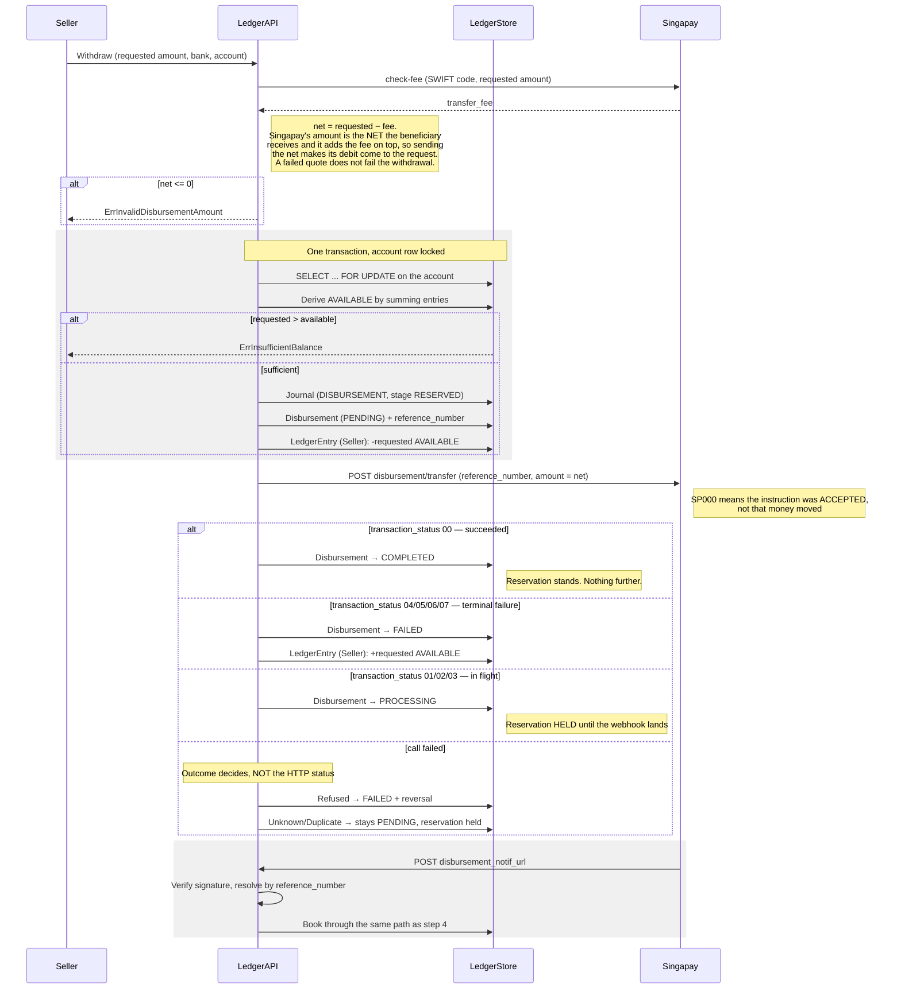

# Withdrawal (Disbursement) — Architecture Diagram

This diagram outlines how a seller withdraws their available balance to a bank account.

## Key concepts

- **Journal**: EventType `DISBURSEMENT`, with a `stage` of `RESERVED`, `SETTLED` or `REVERSED`.
- **Seller entry on request**: `-requested` from **AVAILABLE**.
- **Seller entry on a known failure**: `+requested` into **AVAILABLE**.

## The three amounts

One subtraction, and every other number follows from it:

| | Rp | |
|---|---|---|
| Requested (`disbursements.amount`) | 15.000 | what the seller asked for, and the whole of the balance debit |
| − Transfer fee (`disbursements.gateway_fee`) | 3.000 | quoted by check-fee, **deducted from** the request |
| = Net (sent to Singapay) | 12.000 | what the beneficiary receives |

The fee is never an extra charge beside the withdrawal. A seller who withdraws Rp 15.000
loses Rp 15.000 of balance and receives Rp 12.000 — not Rp 18.000 of balance for Rp 15.000
received.

Singapay's arithmetic runs the other way: its `amount` is the net the beneficiary receives
and it debits the sub-account `net + fee`. Sending the net is therefore precisely what makes
its debit equal the requested amount, so the reservation and the gateway agree.

**If the fee cannot be quoted** it is taken as zero, the full request is sent as the net, and
the platform sub-account absorbs the transfer fee. The seller is never short-changed by a
quote that failed; the drift lands on the platform and is logged.

## Why the order is what it is

**The row and its reference are written before Singapay is called.** If the call came first,
a crash between the payout and the commit would lose the reference — and the payout could
never be asked about again, only judged by hand.

**The balance is reserved, not merely checked.** Balances are derived by summing
`ledger_entries`, so two *different* withdrawals racing each other both pass a bare check and
both pay out. Idempotency does not help: each is a distinct payout with its own reference.
Only holding the money at request time does, and only under a row lock — checking outside the
transaction and writing inside it is the same race with extra steps.

**The reservation is the requested amount, and so is the reversal.** The fee is already
inside it, because the payout goes out for the net — so Singapay's debit of `net + fee` comes
to the same number the ledger held. Reserving `requested + fee` would bill the seller the fee
twice: once by shrinking what they receive, and once again against their balance. The two
figures must also stay equal to each other; a reversal that releases anything other than what
was reserved hands back more or less than was held.

## The failure taxonomy

This is the part that decides whether money can be paid out twice.

Singapay returns **HTTP 400** for `SP001`, `SP002`, `SP004` and `SP005`, and its own
documentation says to call inquiry-status for every one of them because the transfer may
still settle. A "4xx means definite refusal" heuristic would release the reservation on all
four.

| `singapay.Outcome` | Meaning | Reservation |
|---|---|---|
| `OutcomeRefused` | Singapay declined before moving anything | **Released**, disbursement `FAILED` |
| `OutcomeDuplicate` | The reference already exists; the original may have succeeded | **Held** — inquire, never re-send |
| `OutcomeUnknown` | No answer, or an answer that says nothing about the money | **Held** — the only state from which the truth is recoverable |

`RetryDisbursement` resolves the held cases. It **inquires first**: if Singapay knows the
reference, its answer is booked and nothing is sent. Only a reference Singapay has never seen
(`SP009`) is actually transmitted. Any other inquiry failure leaves the question open, and an
open question is not a licence to send money again.

`COMPLETED` and `FAILED` are terminal and are refused outright. A row with no stored
reference is refused too: minting one would look like a protected retry while handing
Singapay a reference it has never seen, so a payout that already went out would go out again.
